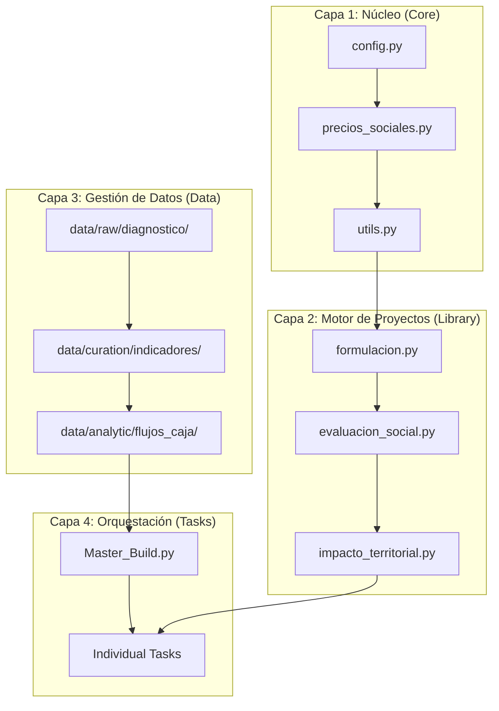

# 🏗️ LPI - Laboratorio de Proyectos de Inversión 2026

## Proyectos de Inversión Pública (Ciclo 7) - Universidad Nacional de Loja

El **Laboratorio de Proyectos de Inversión (LPI)** es una extensión del ecosistema CIE diseñada para la formulación y evaluación técnica, económica y social de proyectos de inversión pública. 

Este repositorio integra el análisis econométrico con marcos normativos de contratación pública y metodologías de evaluación costo-beneficio, permitiendo una gestión de proyectos basada en evidencia reproducible.

---

## 📜 Filosofía de Ingeniería

Nuestra operatividad se rige por tres principios innegociables:

1.  **Public Investment Integrity**: Validación rigurosa de precios sociales, tasas de descuento y flujos de caja. El sistema detecta inconsistencias en la viabilidad financiera antes de proceder a la fase de evaluación social.
2.  **Evidence-Based Formulation**: Integración de datos territoriales y diagnósticos de campo en el motor de formulación.
3.  **Reproducibilidad Social**: El cálculo del Valor Actual Neto Social (VANS) y la Tasa Interna de Retorno Social (TIRS) debe ser auditable y reproducible mediante scripts.

---

## 🏗️ Arquitectura de 4 Capas

El sistema se organiza de forma modular para permitir la gestión integral del ciclo del proyecto:



---

## 🚀 Guía de Inicio para el Investigador

### 1. Configuración del Laboratorio
El LPI utiliza `uv` para la gestión de dependencias y el entorno virtual:
```bash
# Instalar dependencias
uv sync

# Activar venv
source .venv/bin/activate
```

### 2. Variables de Entorno
Es obligatorio exportar el `PYTHONPATH` para habilitar el motor interno:
```bash
export PYTHONPATH=src
```

### 3. Ejecución de Tareas por Unidad
Cada unidad del sílabo tiene un Master Build que secuencia la formulación:
```bash
# Ejecutar toda la Unidad 1: Identificación y Diagnóstico
python src/orchestration/M01-U1-PIP-Master_Build.py
```

---

## 📂 Estándares de la Tareas (Nomenclatura)

Las tareas deben nombrarse siguiendo el estándar institucional:
`[Tarea]-[Unidad]-[Materia]-[Tema].py` (Ej: `T01-U1-PIP-Diagnostico_Loja.py`).

---

## 📚 Recursos Académicos

Para mantener la raíz del repositorio limpia y enfocada en lo esencial, los materiales de soporte se organizan en:
- **[Sílabo de la Materia](docs/syllabus/SYLLABUS.pdf)**: Guía oficial del curso.
- **[Lecturas y Referencias](docs/readings/)**: Material bibliográfico y artículos técnicos.

---

## 🧪 Verificación de Calidad (QA)

Antes de cada entrega, se debe validar que los cálculos de VAN/TIR son estables:
```bash
python -m pytest
```

---
*Laboratorio de Proyectos de Inversión - Facultad Jurídica, Social y Administrativa. UNL.*
