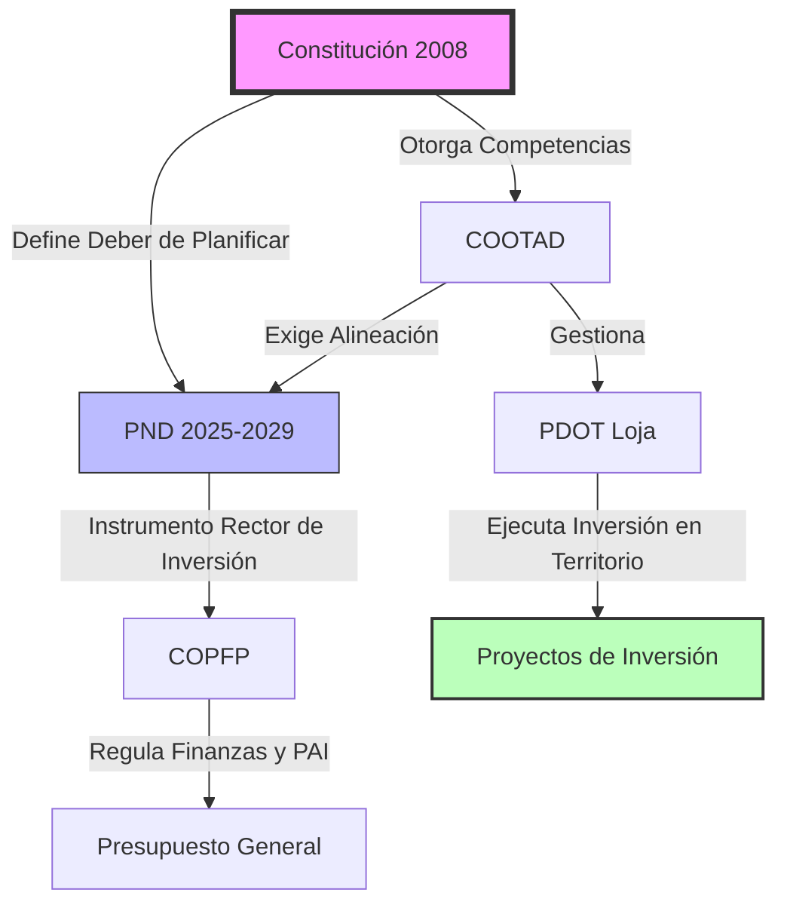

## 1. Diagramas de Flujo (Mermaid)
Este diagrama resume la jerarquía normativa:



## 2. Gráficos Dinámicos (Python + Jupyter)
Resultados del análisis presupuestario:

```{python}
import matplotlib.pyplot as plt
import pandas as pd

datos = {
    'Año': [2025, 2026, 2027, 2028, 2029],
    'Inversión (Millones $)': [450, 520, 610, 750, 890]
}
df = pd.DataFrame(datos)

plt.figure(figsize=(8, 4))
plt.bar(df['Año'], df['Inversión (Millones $)'], color='#4a90e2')
plt.title('Presupuesto Proyectado para el Eje Social PND 2025')
plt.ylabel('Millones de USD')
plt.grid(axis='y', linestyle='--', alpha=0.7)
plt.show()
```

## 3. Tablas Enriquecidas
Presentación de datos estructurados:

```{python}
from tabulate import tabulate
print(tabulate(df, headers='keys', tablefmt='pipe', showindex=False))
```
